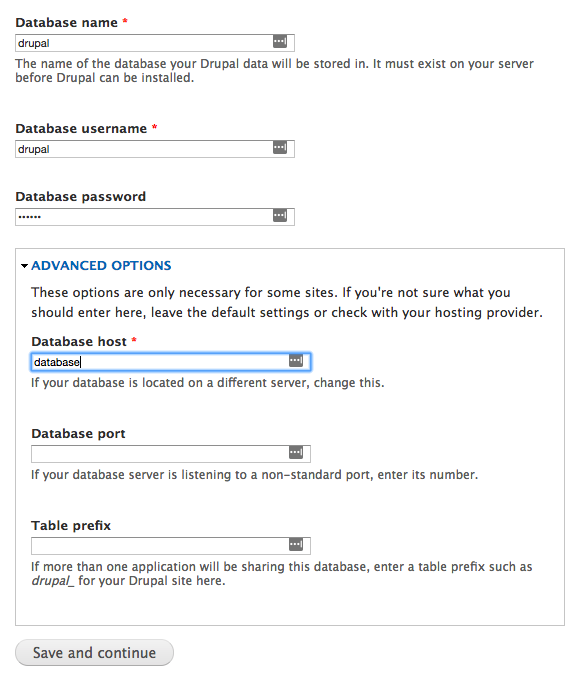

Running a Drupal7 App
=====================

Now that you've successfully [built your first Lando app](./lemp-app.md) it's time to try something a little more complicated like a Drupal 7 app. Let's turn to our examples again.

1.  Start up your app
---------------------

```bash
# Clone down the Lando repo so we can use some examples
git clone https://github.com/kalabox/lando.git
cd lando/examples/drupal7

# Pull down the images and start the app
lando start
```

Try visting `https://drupal7.lndo.site/install.php` in your browser. You should see the Drupal 7 install page.

2.  Install Drupal
------------------

Using `lando info` get credentials and internal connection info for your database so you can use it during the Drupal install.

Proceed through the Drupal install. When it prompts you for database credentials you will want to do something like this:



When you complete this installation you should have a fully running D7 site.

3.  Check out the app directory structure
----------------------------------------

If you inspect the directory structure of this example app you will see that it contains:

```bash
./
|-- config          Some special config for our app
  |-- mysql         Drupal tuned mysql config
  |-- nginx         Drupal nginx config
  |-- php           Drupal tuned php.ini
|-- www             The Drupal code
  |-- includes
  |-- misc
  ...
  |-- web.config
  |-- xmlrpc.php
|-- .lando.yml      The Lando configuration for this app
```

Notice that we are using our own Drupal 7 tuned configuration files and that these files, Drupal and the `.lando.yml` are all self contained within this directory.

4. Examine the `.lando.yml`
---------------------------

Check out the `.lando.yml` file that lets us power this app.


